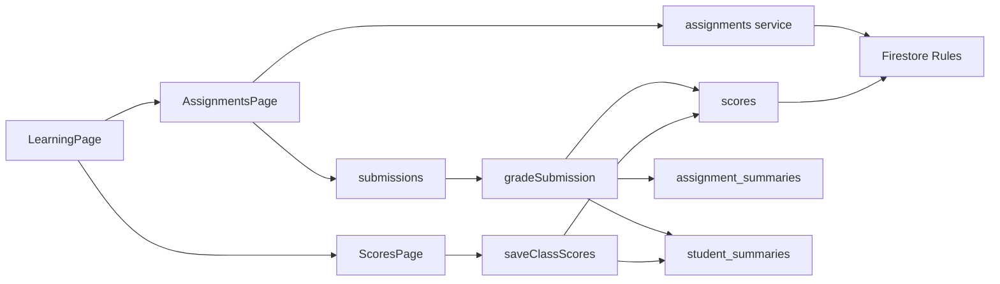

# Kế hoạch rà soát và thiết kế lại Bài tập - Sổ điểm

Ngày: 31/07/2026  
Phạm vi: Admin và Teacher  
Trạng thái: Demo chờ duyệt, chưa áp dụng vào production

## 1. Định hướng thiết kế

Đây là redesign có bảo toàn kiến trúc và design token hiện tại. Mục tiêu chính là rút ngắn thời gian từ lúc mở module đến lúc hoàn tất chấm bài hoặc lưu điểm.

- Design variance: 5/10, cân bằng và hiện đại.
- Motion intensity: 3/10, chỉ dùng chuyển trạng thái ngắn 150-250ms.
- Visual density: 8/10, tối ưu cho bảng điểm và danh sách bài nộp.
- Hệ màu: giữ primary blue hiện hữu, dùng màu trạng thái có cả nhãn chữ.
- Responsive: bảng trên desktop, thẻ theo học sinh trên mobile.

## 2. Bản đồ module hiện tại

## 3. Kết quả rà soát

### Mức ưu tiên cao

1. `ScoresPage` chưa phải một sổ điểm hoàn chỉnh. Trang chỉ cho nhập một đợt điểm mới, không tải hoặc hiển thị các điểm đã lưu bằng `listScoresByClass`.
2. Xóa nội dung ô điểm chuyển giá trị thành `0` vì dùng `Number("")`. Nhập nhận xét trước điểm cũng tạo điểm `0`, có nguy cơ lưu dữ liệu ngoài ý muốn.
3. Khi đổi lớp hoặc đổi tab, dữ liệu điểm đang nhập không có cảnh báo và có thể bị mất.
4. Nút chấm bài không khóa theo mutation đang chạy, không có trạng thái theo từng dòng và không báo thành công. Người dùng có thể gửi lặp.
5. Form tạo bài chọn âm thầm `subjectIds[0]`. Lớp có nhiều môn có thể gắn sai môn.

### Mức ưu tiên trung bình

1. Danh sách bài chỉ hiện hạn nộp, chưa sử dụng `assignment_summaries` để ưu tiên bài chờ chấm, sắp hết hạn hoặc có học sinh làm lại.
2. `SubmissionRow` khởi tạo state từ props một lần. Sau refetch, dữ liệu server mới có thể không đồng bộ lại vào ô nhập nếu component giữ nguyên key.
3. “Nhắc chưa nộp” gọi service trực tiếp, thiếu loading, error, success và chống thao tác lặp.
4. Hệ thống hỗ trợ trạng thái `draft`, `published`, `closed`, nhưng giao diện luôn tạo `published` và chưa có luồng đóng/mở bài.
5. Trường môn học ở Sổ điểm là mã nhập tay thay vì lựa chọn từ môn đã gán cho lớp.
6. Nhãn “Lưu điểm cả lớp” không đúng với hành vi thực tế vì service chỉ lưu các học sinh đã có trong `entries`.

### Toàn vẹn dữ liệu và Rules

1. Rules của assignment chưa xác minh `subjectId`, `lessonPlanId`, `sessionId` cùng thuộc `classId`.
2. Điểm thủ công chưa có kiểm tra trực tiếp trong Rules rằng học sinh thuộc roster của lớp. Giao dịch hiện tại thường chặn gián tiếp qua `student_summaries`, nhưng invariant nên được thể hiện rõ.
3. Reminder bài tập không có vòng đời `resolvedAt` khi học sinh đã nộp bài.
4. `assignment_summaries.totalStudents` được chụp lúc tạo bài và có thể lệch nếu roster lớp thay đổi sau đó.
5. Khi chuyển bài nộp đã chấm về “làm lại”, score bị ẩn bằng `published: false`, nhưng `latestScore` trong student summary vẫn có thể giữ điểm cũ.

## 4. Khác biệt vai trò đề xuất

### Teacher

- Mặc định mở danh sách bài cần xử lý của các lớp được phân công.
- Tạo bài, chấm từng học sinh, yêu cầu làm lại và nhập điểm nhanh.
- Không nhìn thấy lớp ngoài phạm vi được giao.
- Có cảnh báo dữ liệu chưa lưu khi đổi lớp, bài hoặc tab.

### Admin

- Mặc định có góc nhìn toàn trung tâm và bộ lọc giáo viên/lớp.
- Có thể rà soát và điều chỉnh điểm nhưng phải hiển thị cảnh báo quyền Admin.
- Mọi điều chỉnh điểm cần audit log gồm lớp, học sinh, đầu điểm, giá trị cũ và mới.
- Có tác vụ xuất báo cáo, xem ngoại lệ và lịch sử chỉnh sửa.

## 5. Cấu trúc giao diện đề xuất

### Nhánh Bài tập

1. KPI công việc: đang mở, chờ chấm, cần làm lại, tỷ lệ hoàn thành.
2. Rail bài tập có lớp, hạn nộp, tiến độ và trạng thái.
3. Chi tiết bài hiển thị số đã nộp, đã chấm, làm lại và chưa nộp.
4. Desktop dùng bảng chấm nhanh; mobile dùng thẻ theo học sinh.
5. Mutation và phản hồi lỗi/thành công gắn theo từng học sinh.

### Nhánh Sổ điểm

1. Bộ chọn lớp, môn, kỳ đánh giá và chế độ xem.
2. Ma trận học sinh x đầu điểm với cột học sinh cố định.
3. Phân biệt điểm đồng bộ từ bài tập và điểm nhập thủ công.
4. Theo dõi số ô thay đổi, hoàn tác và cảnh báo khi rời trang.
5. Mobile chuyển thành thẻ học sinh, không ép bảng rộng vào màn hình nhỏ.

## 6. Kế hoạch triển khai sau khi duyệt

1. Gia cố service và Rules, bổ sung test cho quan hệ lớp - môn - bài - học sinh.
2. Tách data container khỏi presentation cho Assignments và Gradebook.
3. Triển khai Bài tập, giữ nguyên route và query tab hiện tại.
4. Triển khai Sổ điểm bằng dữ liệu hiện có, không tạo collection mới nếu chưa cần.
5. Bổ sung dirty-state protection, feedback, Admin audit và responsive.
6. Chạy unit test, Rules emulator, lint, typecheck, build và kiểm tra 375/768/1440px.

## 7. Tiêu chí duyệt demo

- Teacher hoàn tất chấm một bài với ít lần chuyển ngữ cảnh hơn.
- Admin nhận biết rõ khi đang điều chỉnh bằng quyền quản trị.
- Không còn khả năng lưu điểm `0` chỉ vì xóa ô hoặc nhập nhận xét trước.
- Điểm đã lưu xuất hiện lại trong Sổ điểm.
- Bảng không gây tràn ngang toàn trang trên mobile.
- Mọi hành động bất đồng bộ có loading, success và error rõ ràng.

